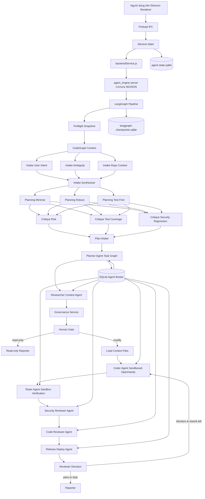
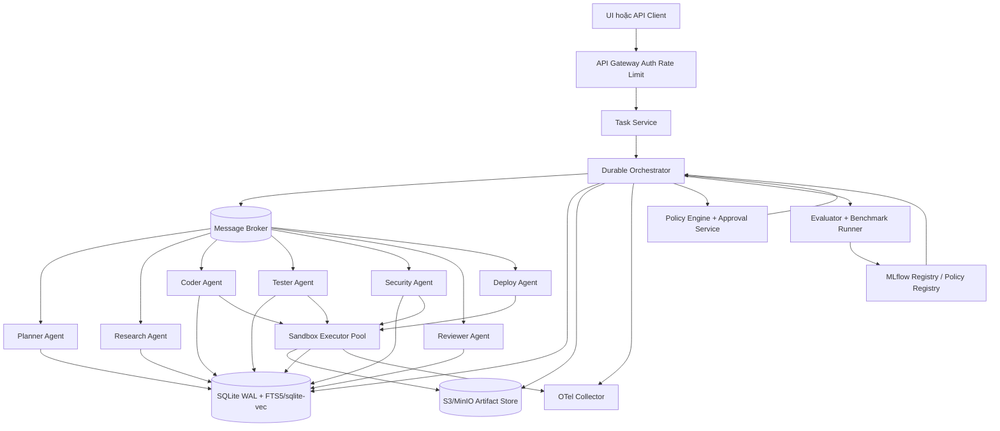

# Đánh giá chuyên sâu dự án dagent

## Tóm tắt điều hành

`dagent` hiện đã có một “xương sống” agentic tương đối rõ: Electron chỉ đóng vai trò UI + điều phối cục bộ, còn pipeline chính chạy trong backend Python bằng LangGraph. Ban đầu luồng là preflight, codegraph context, intake committee, planning committee, critique layer, plan arbiter, human gate, một OpenHands worker duy nhất, automated review và reporter. Sau pha multi-agent hóa, repo đã thêm Planner, Researcher/Context, Coder, Tester, Security Reviewer, Code Reviewer và Release/Deploy Agent với role contracts, SQLite broker, sandboxed Coder/Tester và reviewer decision. Đây là một nền tảng tốt để đi tiếp vì luồng tư duy đã được formalize thành graph thay vì một vòng lặp prompt tự do. citeturn21view0turn10view2turn10view3turn10view4

Tuy vậy, dự án **chưa phải một hệ thống multi-agent production-grade phân tán**. Nó đã vượt khỏi mô hình single-writer thuần bằng role ownership, task graph và broker cục bộ, nhưng broker hiện vẫn là SQLite local-first chứ chưa phải NATS/Kafka/RabbitMQ; sandbox hiện là workspace copy/merge policy chứ chưa phải container/VM isolation; observability đã có OpenTelemetry nền nhưng chưa có collector/dashboard/alerting hoàn chỉnh. Điều đó khác đáng kể với các framework multi-agent vận hành lớn, nơi orchestration có thể là handoff giữa specialist agents, có state bền vững xuyên worker, guardrails, observability, memory, và khi cần thì có message-driven execution phân tán. citeturn12view2turn39search2turn39search5turn34search7turn39search0

Khoảng cách lớn nhất của `dagent` ban đầu nằm ở bốn điểm. Thứ nhất, **state và HITL chưa bền vững**: graph compile với `InMemorySaver()`, trong khi LangGraph khuyến nghị dùng persistence/checkpointer để hỗ trợ continuity, human-in-the-loop và fault tolerance; Human Gate chỉ trả về một message “gửi lại với chữ xác nhận”. Thứ hai, **execution plane chưa được harden**: `allowedFiles` chủ yếu là contract ở prompt cho worker. Thứ ba, **platform layer còn cục bộ và chưa portable**: Electron main process spawn Python trực tiếp qua đường dẫn `.venv\Scripts\python.exe`, nghĩa là Windows-first và không có backend API tách rời. Thứ tư, **observability, testing, CI/CD, security, learning loop** vẫn còn mỏng. Pha nền móng đã bắt đầu xử lý các điểm này bằng backend HTTP nội bộ, SQLite state/checkpoint, approval bền, Python runtime portable, auth config và hard policy cho `allowedFiles`. citeturn10view4turn34search0turn34search5turn42view0turn12view2turn34search2turn26view0turn38search3

Nếu mục tiêu của bạn là biến dự án thành một hệ thống đa tác nhân có khả năng tự động thực hiện task, mở rộng tốt, và “tự phát triển” theo quy trình chuẩn, thì hướng đi phù hợp không phải là thêm nhiều prompt hơn vào graph hiện tại. Hướng đúng là **tách control plane và execution plane**, thêm **durable orchestration**, đưa agent communication sang **event-driven messaging**, chuẩn hóa **task model + state store + memory store + evaluation loop**, và chỉ cho phép “self-improvement” dưới một vòng governance có đo lường, registry, rollback và human approval ở những thay đổi quan trọng. Với định hướng hiện tại, state/memory nên đi bằng **SQLite WAL + LangGraph SQLite checkpointer** trước, có thể bổ sung FTS5/sqlite-vec cho retrieval memory khi cần; message broker như NATS JetStream hoặc Kafka, OpenTelemetry cho tracing/metrics/logs, và MLflow cho lineage/evaluation/registry vẫn là các mảnh phù hợp nếu sau này mở rộng learning hoặc policy optimization. citeturn34search21turn38search4turn36search4turn36search9turn35search1turn35search0turn38search3turn38search2turn38search10

Bảng dưới đây tóm tắt các thiếu sót quan trọng nhất và mức ưu tiên xử lý.

| Hạng mục | Thiếu sót chính | Tác động | Ưu tiên |
|---|---|---:|---:|
| Stateful orchestration | Ban đầu dùng `InMemorySaver()`; pha nền móng đã chuyển sang SQLite checkpointer và durable approval workflow cục bộ. citeturn10view4turn42view0turn34search0turn34search5 | Rất cao | Cao |
| Multi-agent thực sự | Chỉ có một worker có quyền tool/write; các “agent” còn lại là node deliberation tuần tự. citeturn10view2turn10view3turn12view2turn34search7 | Rất cao | Cao |
| Execution hardening | Ban đầu `allowedFiles` là prompt contract; pha nền móng đã thêm snapshot/rollback hard policy. citeturn13view3turn12view2 | Rất cao | Cao |
| API và deployability | Không có REST/gRPC backend; chỉ có IPC Electron và stdin/stdout với Python subprocess. citeturn25view0turn23view3turn26view0turn33view0 | Cao | Cao |
| Portability | Ban đầu hardcode `.venv\Scripts\python.exe`; pha nền móng đã thêm Python runtime resolver Windows/Linux/macOS. citeturn26view0turn19view0 | Cao | Cao |
| Observability | Đã thêm OTel tracing/metrics nền với correlation id; còn thiếu collector/dashboard/alerting và log pipeline chuẩn. citeturn33view0turn24view3turn25view0turn38search3turn38search19 | Cao | Cao |
| Testing và CI/CD | Có script `check`, nhưng không thấy `tests/` hay workflow CI trong tree repo snapshot. citeturn19view0turn21view0 | Cao | Cao |
| Auth và model access | Ban đầu thiếu Authorization; pha nền móng đã thêm API key config, còn thiếu retry/backoff/circuit breaker. citeturn11view0turn11view4 | Cao | Cao |
| Kiến trúc trùng lặp | Pipeline JS cũ đã nên được archive khỏi runtime chính để tránh drift; runtime thật là backend Python + LangGraph/OpenHands. citeturn24view4turn26view0turn30view0turn30view1 | Trung bình đến cao | Trung bình |
| Learning loop | Đã có benchmark/evaluator/SQLite registry nền; còn thiếu canary rollout, MLflow/MARL environment và policy optimization thật. citeturn20view0turn38search1turn38search5turn39search1 | Cao nếu mục tiêu là “tự phát triển” | Trung bình đến cao |

## Phạm vi phân tích và các giả định

Phân tích này dựa trên snapshot public của nhánh `main` trên GitHub tại thời điểm truy cập. Root tree cho thấy repo rất gọn, mới chỉ có **1 commit**, gồm hai cây chính là `engine/agent_engine` và `src`, cùng `README.md`, `deep-research-report.md`, `package.json`, `pyproject.toml` và vài file cấu hình cơ bản. Tôi **không thấy** trên tree root các thành phần như `.github/workflows`, `tests/`, `Dockerfile`, hay `LICENSE`; nếu các phần này tồn tại ở private repo hoặc trong môi trường triển khai ngoài repo thì một số nhận định bên dưới cần được hiệu chỉnh. citeturn21view0

Tôi cũng giả định rằng mục tiêu đích của bạn không chỉ là “một desktop coding assistant”, mà là một **hệ thống đa tác nhân production-grade** cho các task phần mềm, có thể chạy tự động, quan sát được, mở rộng được, có governance, và có cơ chế cải tiến liên tục. Điều này quan trọng vì kiến trúc tối ưu cho một app desktop đơn máy khác hẳn kiến trúc tối ưu cho một multi-agent system nhiều worker, có queue, có sandbox, có retry, có rollout và rollback. Trong repo hiện tại, README mô tả ứng dụng desktop Electron chỉ là “lớp điều khiển tối giản”, phần chính là backend Python LangGraph + OpenHands. citeturn21view0

Một giả định nữa cần nêu rõ: khi đánh giá `allowedFiles`, bản snapshot ban đầu chỉ cho thấy chỉ dẫn trong prompt rằng “Do not edit files outside allowedFiles”. Sau pha nền móng, repo đã có thêm guard cứng dạng snapshot/rollback trong `enforce_change_policy()`: mọi file ngoài `allowedFiles` hoặc nằm trong `forbiddenPaths` bị khôi phục và được báo thành policy violation. Đây chưa phải OS-level sandbox trước khi tool ghi file, nhưng đã không còn là prompt-contract thuần. citeturn13view3turn12view2

## Kiến trúc hiện tại của dự án

Ở lớp ứng dụng, `dagent` là một Electron app với renderer, preload và main process. Renderer dùng state object thuần JavaScript để giữ `settings`, `sessions`, `activeSession`, `progress`, `streamLines` và `running`; preload chỉ expose một API nhỏ qua `contextBridge`, còn main process đăng ký IPC handlers để lấy state ban đầu, lưu settings, chọn workspace, quản lý session và gửi task cho agent. Sau pha nền móng, main process khởi động một backend Python HTTP NDJSON nội bộ, nên UI đã tách khỏi engine thực thi tốt hơn, dù backend này vẫn là service local-first chứ chưa phải API multi-tenant/public. citeturn32view1turn32view3turn25view0turn23view3

Về communication path, luồng hiện tại sau pha nền móng là **renderer → preload IPC → Electron main → backendService.js → `agent_engine.server` `/v1/runs` NDJSON → LangGraph → OpenHands SDK**. Đây đã là một Task API local tách khỏi Electron main, nhưng orchestration vẫn centralized và local-first; chưa có message broker, command bus, task queue durable hay worker pool phân tán. citeturn24view4turn26view0turn26view3turn33view0

Ở phía Python, graph hiện tại khá bài bản. Nó tạo các node `preflight`, `codegraph_context`, ba intake agents, `intake_synthesizer`, ba planning agents, ba critique agents, `plan_arbiter`, `human_gate`, `read_only_reporter`, `load_context_files`, `openhands_worker`, `automated_review_stack`, rồi `reporter`. Luồng edge cho thấy đây là một **committee pipeline**: intake song song, planning song song, critique song song, rồi hợp nhất về arbiter, sau đó mới cho một worker ghi file. Đó là lựa chọn đúng nếu mục tiêu là giảm “prompt drift” và tăng chất lượng plan trước khi sửa code. citeturn10view2turn10view3turn42view4

Ban đầu graph compile với `InMemorySaver()` và khi invoke chỉ truyền `thread_id` bằng `sessionId`. Sau pha nền móng, graph dùng `SqliteSaver` từ `langgraph-checkpoint-sqlite` như persistence bắt buộc. Đây là bước đúng cho continuity/HITL local, dù chưa thay thế durable orchestrator kiểu Temporal nếu sau này cần workflow replay/retry xuyên máy. citeturn10view4turn34search0turn34search8

Quản lý trạng thái ban đầu có hai tầng rời rạc: tầng UI/session dùng `sessions.json` và `settings.json` trong thư mục `userData` của Electron, còn tầng graph state nằm trong LangGraph checkpointer in-memory. Sau pha nền móng, hướng đúng là gom state cục bộ về **SQLite**: settings, sessions, messages, runs và approvals nằm trong `agent-state.sqlite`, còn graph checkpoint nằm trong SQLite checkpointer riêng. Cách này chưa thay thế một orchestrator phân tán, nhưng đã biến “chat history/UI persistence” thành một operational state store cục bộ có thể migrate, query và audit tốt hơn. citeturn28view2turn28view3turn28view4turn28view5turn10view4

Về lưu trữ và memory, engine hiện đọc snapshot workspace, trusted repo context và codegraph context. `trusted_context()` chỉ trust một allowlist file ở root như `AGENTS.md`, `README.md`, `package.json`, `pyproject.toml`; đây là một quyết định **đúng và có chủ ý** để giảm instruction injection từ file bất kỳ trong repo. `codegraph_context()` cũng có thể auto-init index nếu thiếu, nên semantic context được dùng tương đối tốt cho code understanding. Nhưng memory hiện vẫn chỉ là **repo snapshot + codegraph + chat messages**, chưa có long-term memory theo user/project, chưa có vector memory hoặc knowledge graph, chưa có artifact store chuẩn. citeturn14view1turn15view3turn14view4turn40view0turn34search0

Về execution, OpenHands worker được cấu hình theo hướng “single writer”: dùng `LLMSummarizingCondenser`, chỉ bật `TerminalTool`, `FileEditorTool`, `TaskTrackerTool`, và đặt `tool_concurrency_limit=1`. Đây là một quyết định an toàn hợp lý trong giai đoạn đầu. Nhưng nó cũng cho thấy sự thật kiến trúc: **hệ thống chưa có nhiều worker chuyên trách**; chỉ có một worker coding duy nhất, chạy local workspace, local tool plane, và sử dụng local Conversation run loop. OpenHands SDK chính thức cho biết nó không chỉ hỗ trợ local machine mà còn hỗ trợ ephemeral workspaces qua Agent Server, Docker hoặc Kubernetes; hiện tại repo của bạn mới dùng mô hình local machine. citeturn12view2turn12view1turn13view6turn34search2

API layer đã có bước đầu bằng `/v1/runs` NDJSON trong `agent_engine.server`, đủ để Electron main không còn gọi trực tiếp graph như một subprocess one-shot. Tuy vậy, đây vẫn là API local nội bộ; để mở rộng thành hệ thống nhiều tác nhân, nhiều worker, nhiều client, hoặc chạy headless trong CI/CD, webhook, cron, external integrations, bạn vẫn cần contract API đầy đủ hơn cho auth, tenancy, queueing, cancellation, retry và artifact retrieval. citeturn25view0turn23view3turn26view0turn33view0

Ở góc bảo mật, repo có vài điểm tốt: renderer bật `contextIsolation: true`, tắt `nodeIntegration`, và trusted repo context có allowlist riêng. Các khe hở quan trọng ban đầu gồm BrowserWindow `sandbox: false`, Python verification dùng `subprocess.run(..., shell=True)` dù có allowlist command, pipeline JS cũ có helper command riêng, `ChatClient` thiếu Authorization header, và Human Gate chỉ dựa vào chữ xác nhận trong prompt. Pha nền móng đã xử lý một phần: pipeline JS cũ được archive, `ChatClient` nhận API key, Human Gate có approval bền trong SQLite, và worker có hard policy rollback khi ghi ngoài `allowedFiles`. citeturn23view1turn23view2turn23view0turn14view2turn15view2turn31view2turn31view4turn11view0turn42view0turn34search1turn34search5

Logging và monitoring ban đầu rất sơ khai: `run.py` chỉ emit JSON `progress` với `stage/detail/at`; main process forward sang renderer bằng sự kiện `agent:progress`; renderer chỉ append progress vào state để hiển thị. Pha observability đã bổ sung OpenTelemetry trong backend Python: mỗi task có trace root, mỗi node LangGraph là `agent.step`, các tool call chính có child span, broker events mang `correlationId`, và metrics nền gồm queue/run latency, run status, verification pass/fail, rework count, token usage, sandbox failures, approval latency, crash recovery count. Phần còn thiếu để vận hành thật là collector, dashboard, alerting, log pipeline và error-budget/SLO. citeturn33view0turn24view3turn25view0turn32view4turn38search3turn38search19

## Khoảng cách so với các mẫu multi-agent tiêu chuẩn

Nếu so với **AutoGen**, dự án của bạn mới có một phần của “multi-agent conversation framework”: có các specialist prompts ở intake/planning/critique, nhưng không có conversation/handoff năng động giữa các agent với ownership rõ ràng cho từng role. AutoGen nhấn mạnh khả năng cho nhiều agent conversable tương tác với nhau và với humans/tools theo các pattern linh hoạt; còn `dagent` hiện dùng một DAG khá cứng, nơi mọi quyết định cuối cùng quy về `plan_arbiter` rồi một worker duy nhất thực thi. Điều này tốt cho kiểm soát, nhưng chưa đạt đến mức multi-agent collaboration đúng nghĩa. citeturn34search3turn34search7turn10view2turn10view3

Nếu so với **OpenAI Agents SDK**, dự án của bạn hiện chủ yếu mới nằm ở nhánh “application-owned orchestration” ở mức đơn giản: bạn có code quyết định agent nào chạy trước sau, nhưng chưa có pattern handoff giữa specialists, chưa có runtime loop chuẩn cho continuation strategies, chưa có sandbox agents riêng, chưa có orchestration policy theo tác vụ. Tài liệu Agents SDK nhấn mạnh rằng khi cần nhiều agent, bạn phải quyết định agent nào chạy, theo thứ tự nào, và ai “own” reply; đó chính là phần `dagent` đang còn phẳng và tập trung vào một planner DAG + single writer. citeturn39search2turn39search5

Nếu so với **CrewAI**, repo của bạn hiện chưa có sự tách biệt rõ giữa “crews làm việc” và “flows quản lý state và execution order”. CrewAI coi Flows là event-driven workflows có state, còn Crews là nhóm agent hợp tác thực hiện task; đây là một cách rất sát với nhu cầu của bạn khi muốn có hệ thống đa tác nhân có guardrails, memory, knowledge và observability baked in. `dagent` hiện có một graph tốt cho flow, nhưng team/crew layer vẫn chưa thật sự tồn tại. citeturn39search0turn39search3turn39search6turn39search18

Nếu nhìn theo góc **MARL**, thì khoảng cách còn lớn hơn. MARL đòi hỏi một multi-agent environment, nơi nhiều agent tương tác tuần tự hoặc đồng thời, có episode, observation, action, reward, policy update, và thường cần evaluator/trainer như RLlib hoặc môi trường chuẩn như PettingZoo. `dagent` hiện không có dependency học tăng cường, không có environment API, không có reward function, không có data collection/policy optimization, không có self-play, cũng không có model registry cho iterative policy improvement. Vì vậy, nếu bạn gọi `dagent` là “multi-agent”, điều đó đúng theo nghĩa orchestration LLM agents; nhưng theo nghĩa MARL, hiện nó **chưa chạm tới**. citeturn20view0turn38search1turn38search5turn39search1turn39search16

Ngoài ra, ngay cả theo chuẩn **LangGraph production patterns**, dự án vẫn đang có khoảng cách. LangGraph có persistence/checkpointer/store cho short-term và long-term memory, có interrupts đầy đủ cho HITL, còn OpenHands SDK có local lẫn ephemeral workspaces để tăng isolation. `dagent` đã bắt đầu dùng SQLite checkpointer và durable approval cục bộ, nhưng vẫn cần tiến thêm nếu muốn workflow suspension/resumption chuẩn, external approver service, sandbox isolation mạnh hơn và observability end-to-end. citeturn34search0turn34search5turn34search2turn10view4turn42view0

## Các thiếu sót chi tiết và mức ưu tiên

Thiếu sót mang tác động cao nhất ban đầu là **durability của workflow và HITL**. Pha nền móng đã chuyển sang durable approval workflow trong SQLite, nên việc gửi “xác nhận” trong cùng phiên phê duyệt task gốc thay vì tạo task mới. Tuy vậy, đây vẫn chưa phải interrupt/resume chuẩn của LangGraph với external approver service, timeout policy và replay đầy đủ. citeturn42view0turn42view2turn34search5turn34search0

Thiếu sót cao thứ hai là **open-path execution guard**. Pha nền móng đã thêm hard policy dạng snapshot/rollback: sau khi OpenHands worker chạy, hệ thống kiểm tra diff thực tế, rollback file ngoài `allowedFiles` hoặc trong `forbiddenPaths`, rồi trả blocker. Đây là enforcement tốt hơn prompt contract, dù về lâu dài vẫn nên nâng lên sandbox rule hoặc policy middleware trước khi tool ghi file. citeturn21view1turn13view3turn13view6turn12view2

Thiếu sót cao tiếp theo là **thiếu durable API/orchestration backend**. Hiện tại app chỉ chạy qua Electron main process và Python subprocess. Khi workload dài, nhiều task song song, hay cần dispatch cho nhiều worker host khác nhau, kiến trúc này sẽ ngăn bạn scale ngang. Temporal cho durable execution, hoặc kết hợp LangGraph với Temporal activities, là bước rất đáng cân nhắc vì nó cho workflow crash-proof, retry, replay và pause/resume xuyên process/máy. citeturn26view0turn33view0turn38search4turn38search8

Một lỗi kiến trúc tương đối rõ ban đầu là **dùng `InMemorySaver()` trong khi lại đã truyền `thread_id`**. Việc chuyển sang SQLite checkpointer làm intent stateful sessions khớp implementation hơn, nhất là với desktop local. Với multi-agent production, điểm còn thiếu là durable workflow orchestration bên ngoài process. citeturn10view4turn34search8

Về tính đúng của flow, pha nền móng đã xử lý hai điểm đáng chú ý: Human Gate chuyển sang durable approval workflow, và `load_context_files()` không còn cố đọc glob trong `allowedFiles` như `todo-app/**`. Đây là sửa nhỏ nhưng trực tiếp giảm lỗi ở task tạo project mới. citeturn41view2turn42view4

Một chỗ sai khác là **normalization cho project creation đang tự thêm `npm run build` vào `verificationCommands`** khi task tạo project. Điều này ngầm giả định project mới là web app Node-based; nếu task thực tế tạo Python service, Go CLI hay Rust app, default này sẽ sai hoặc tạo blockers giả. Vì repo README có nói nhiều đến new web apps, quyết định này có lý ở một use case, nhưng nếu mục tiêu là “hệ thống đa tác nhân hoàn thiện” thì không nên hardcode workflow verify vào một stack duy nhất. citeturn41view2turn41view3

Ở lớp tương thích nền tảng, hardcode `.venv\Scripts\python.exe` đã được thay bằng `pythonRuntime.js`, ưu tiên `.venv` đúng theo Windows/Linux/macOS rồi fallback `py -3` hoặc `python3`. Script `check` cũng gọi helper này, nên đường chạy đã portable hơn cho container/cloud runner. citeturn26view0turn19view0

Về model access, `ChatClient` đã nhận API key từ settings và gửi Authorization header; OpenHands worker cũng dùng cùng key, fallback về `LLM_API_KEY` nếu UI không cấu hình. Phần còn thiếu cho production là retry/backoff, circuit breaker, timeout policy theo loại request và key rotation. citeturn11view0turn11view4turn12view2

Về bảo trì mã nguồn, repo ban đầu mang dấu hiệu **kiến trúc chuyển tiếp**: có một pipeline JS lớn `src/main/agentPipeline.js` mô phỏng committee + single writer, nhưng runtime thật đi qua Python engine. Việc archive pipeline JS cũ sang `archive/` là đúng hướng vì giảm drift, giúp người mới nhìn vào `src/main` thấy đường chạy thật: Electron IPC → backend service → LangGraph/OpenHands. citeturn24view4turn26view0turn30view0turn30view1

Testing và CI/CD cũng còn non. `package.json` chỉ có script `check` để `node --check` các file JS và `python -m compileall engine`; repo root snapshot không cho thấy `tests/` hay workflow CI. Nghĩa là hiện bạn mới có **syntax gate**, chưa có unit test, integration test, contract test cho graph state, golden tests cho prompt schema, hay end-to-end test cho workspace mutation. Với hệ thống agentic, đây là thiếu sót lớn vì bug thường nằm ở orchestration và state transitions, không chỉ ở syntax. citeturn19view0turn21view0

Cuối cùng, nếu xét theo yêu cầu “tự phát triển mạnh mẽ”, thiếu sót lớn ban đầu là **không có evaluator-learning-governance loop**. Pha evaluation đã bổ sung benchmark nội bộ, rubric cố định, evaluator runner và SQLite experiment registry để so sánh model/prompt/policy versions. Đây mới là tầng đo lường nền; repo vẫn chưa có ML/training stack, canary rollout, MLflow registry hoặc environment chuẩn kiểu MARL. Bạn có thể thêm “self-improvement”, nhưng phải làm theo hướng **measured optimization** chứ không phải để agent tự sửa hệ thống của chính nó một cách vô kiểm soát. citeturn20view0turn38search2turn38search6turn38search10turn38search22

## Kiến trúc cải tiến được đề xuất

Tôi đề xuất chuyển `dagent` từ mô hình **desktop-local orchestrated coding assistant** sang mô hình **multi-agent platform có control plane, durable orchestration, event bus, sandboxed executors, memory layer, evaluator-learning layer và governance layer**. Electron nên trở thành một client tùy chọn, không còn là “điểm tựa kiến trúc”. Backend nên tách thành service riêng, còn LangGraph nên giữ vai trò tốt nhất của nó: mô tả logic deliberation/handoff trong từng workflow, thay vì ôm trọn mọi thứ. Hệ điều phối durable nên do Temporal hoặc một hệ tương đương đảm nhận. citeturn34search21turn38search4turn39search2turn39search6

Sơ đồ dưới đây mô tả luồng hiện tại sau pha nền móng.

Luồng này có điểm mạnh là rõ ràng và an toàn hơn agent-loop tự do, và đã có role ownership + broker cục bộ. Nhưng nó vẫn là **một chuỗi đồng bộ local-first**. Để thành multi-agent platform hoàn chỉnh, bước sau là đưa broker/orchestrator ra hạ tầng phân tán, tăng isolation bằng container/VM sandbox, và thêm observability chuẩn. citeturn10view4turn26view0turn28view2turn28view4

Trong sơ đồ đề xuất, `Task Service` là nơi chuẩn hóa input thành `task`, `goal`, `constraints`, `tenant`, `priority`, `deadline`, `risk level`, `required capabilities`, `budget` và `approval policy`. `Durable Orchestrator` chịu trách nhiệm tạo workflow instance, retries, timeouts, pause/resume, compensation và rollback. `Message Broker` phục vụ long-running asynchronous coordination giữa agents và executors. `Memory` giai đoạn đầu nên tách rõ: SQLite cho workflow/task/run/approval state; FTS5 hoặc sqlite-vec cho retrieval memory cục bộ; object store cho artifacts, diffs, test logs, patch bundles; graph database chỉ nên thêm khi thật sự cần graph memory/phân tích quan hệ phụ thuộc sâu. citeturn36search4turn36search9turn36search2turn38search4turn35search1turn35search0

Về cơ chế giao tiếp, tôi khuyến nghị tách làm hai lớp. Lớp **sync/request-response** dùng cho control-plane ngắn như tạo task, query status, phê duyệt, lấy kết quả. Lớp **async/event-driven** dùng cho dispatch subtask, tool completion events, evaluator signals, retry events và long-running workers. NATS request-reply rất phù hợp cho service-to-service low latency; Kafka mạnh hơn nếu bạn cần event log quy mô lớn, replay stream và analytics; RabbitMQ hợp với work queue truyền thống; Redis Streams phù hợp giai đoạn đầu nếu muốn đơn giản hóa hạ tầng. citeturn35search1turn35search5turn35search0turn35search8turn35search2turn35search6turn35search3

Bảng dưới đây gợi ý lựa chọn công nghệ cho message broker.

| Lựa chọn | Khi nên dùng | Điểm mạnh | Điểm yếu | Khuyến nghị cho `dagent` |
|---|---|---|---|---|
| NATS JetStream | Điều phối agent/service độ trễ thấp, request-reply, pub/sub | Native pub/sub và request-reply; nhẹ; phù hợp service orchestration. citeturn35search1turn35search5 | Ít phù hợp hơn Kafka cho analytics/event lake rất lớn | **Khuyến nghị mặc định** cho giai đoạn đầu đến trung hạn |
| Kafka | Hệ event streaming lớn, replay, analytics, audit stream dài hạn | Distributed event streaming platform, scale và replay mạnh. citeturn35search0turn35search8 | Vận hành nặng hơn; complexity cao | Dùng khi bạn đi đến multi-tenant, nhiều workflow, BI/event lake |
| RabbitMQ | Queue-based workflow, job dispatch truyền thống | Broker成熟, queue/FIFO rõ ràng, protocol rộng. citeturn35search2turn35search6turn35search22 | Ít tự nhiên hơn cho event fan-out + subject routing kiểu agent mesh | Phù hợp nếu bạn thiên về job queue |
| Redis Streams | Muốn bắt đầu nhanh, môi trường nhỏ | Append-only log, consumer groups, đơn giản. citeturn35search3 | Không phải lựa chọn mạnh nhất cho durable orchestration quy mô lớn | Tốt cho PoC nhưng không nên là đích cuối |

Với state store và memory, tôi khuyến nghị **SQLite WAL** làm “nguồn sự thật” ban đầu. SQLite đủ nhẹ để đi cùng desktop app, đủ bền cho sessions/runs/approvals, và có đường mở rộng tự nhiên qua FTS5 hoặc sqlite-vec nếu cần retrieval memory cục bộ. Khi hệ thống tăng lên multi-host/multi-tenant, có thể đánh giá lại DB server riêng, nhưng pha hiện tại nên ưu tiên ít hạ tầng, dễ backup và dễ debug. citeturn36search4turn36search9turn36search17turn36search2turn36search10turn36search3turn36search19

| Lựa chọn | Vai trò phù hợp | Ưu điểm | Nhược điểm | Khuyến nghị |
|---|---|---|---|---|
| SQLite WAL | Operational state, tasks, runs, approvals | Nhẹ, local-first, dễ backup, không cần DB daemon | Không phù hợp write concurrency rất lớn | **Bắt buộc cho pha đầu** |
| LangGraph SQLite checkpointer | Workflow checkpoints, continuity, HITL state | Bám sát LangGraph, restart không mất checkpoint | Cần dependency `langgraph-checkpoint-sqlite` | **Khuyến nghị mặc định** |
| SQLite FTS5/sqlite-vec | Retrieval memory, semantic/local search | Cùng một file DB, đủ tốt cho desktop/local worker | Không phải vector DB hyperscale | Thêm khi cần memory retrieval |
| Graph DB/vector DB riêng | Dependency graph hoặc vector scale lớn | Mạnh cho nhu cầu chuyên biệt | Thêm hạ tầng và chi phí vận hành | Chỉ cân nhắc giai đoạn sau |

Ở lớp model serving, nếu bạn muốn giữ khả năng “OpenAI-compatible” như hiện tại, vLLM là lựa chọn nội bộ rất mạnh vì có OpenAI-compatible server. Ollama phù hợp local-dev/offline đơn giản; TGI vẫn dùng được nhưng tài liệu hiện ghi rõ nó đang ở maintenance mode và Hugging Face khuyến nghị cân nhắc vLLM hoặc SGLang cho endpoint mới; còn managed API như OpenAI Responses API phù hợp khi bạn muốn dùng tool-rich managed models. citeturn37search0turn37search4turn37search2turn37search10turn37search1turn37search9turn37search3turn37search11

| Lựa chọn | Mạnh ở đâu | Ghi chú | Khuyến nghị |
|---|---|---|---|
| vLLM OpenAI-compatible server | Tự host, throughput tốt, dễ thay local OpenAI-compatible endpoint hiện tại. citeturn37search0turn37search4 | Phù hợp nhất nếu bạn vẫn thích giao diện OpenAI-compatible | **Khuyến nghị self-host** |
| Ollama | Local dev rất nhanh, API đơn giản, streaming JSON rõ ràng. citeturn37search2turn37search6 | Tốt cho dev laptop; yếu hơn khi cần quy mô cao | Phù hợp dev/test |
| TGI | Serving OSS LLM phổ biến, nhiều tối ưu. citeturn37search1turn37search5 | HF ghi maintenance mode cho endpoint mới. citeturn37search9 | Không còn là ưu tiên số một |
| Managed API như OpenAI Responses | Stateful interactions + built-in tools. citeturn37search3turn37search11 | Vendor-managed, chi phí cao hơn, lock-in nhiều hơn | Dùng cho control/questions cần tool phong phú |

Ở lớp orchestration, tôi không khuyên “bỏ LangGraph”. Ngược lại, bạn nên **giữ LangGraph cho deliberation subgraphs**, nhưng đặt nó **bên trong** một orchestration layer bền vững hơn như Temporal. CrewAI cũng đáng tham khảo ở chỗ nó phân biệt Crews và Flows rất rõ; OpenAI Agents SDK hữu ích nếu bạn muốn mô hình handoff theo specialist ownership. Nhưng với codebase hiện tại, hướng thực dụng nhất là: **Temporal cho durable workflow; LangGraph cho internal agent graphs; OpenHands/containers cho execution; NATS cho event coordination.** citeturn38search4turn34search21turn39search6turn39search18turn39search2turn39search5

Nếu bạn thực sự muốn thêm “học tập/tự phát triển”, tôi đề xuất đi theo ba tầng. Tầng một là **evaluation-driven improvement**: log mọi task, outcome, blocker, diff quality, cost, latency. Tầng hai là **policy/prompt/model routing optimization** có registry và canary deploy bằng MLflow. Tầng ba mới là **adaptive scheduling hoặc RL/bandit** cho việc chọn planner, chọn reviewer, chọn tool route hoặc số lượng rework. Nếu đi theo MARL đúng nghĩa, bạn phải có environment chuẩn kiểu RLlib/PettingZoo; còn trong bài toán engineering agent, đa số giá trị thực tế sẽ đến trước hết từ evaluation + routing optimization chứ không phải từ MARL thuần. citeturn38search2turn38search6turn38search10turn38search22turn38search1turn38search5turn39search1

## Lộ trình triển khai, checklist, kiểm thử và CI/CD

Giai đoạn đầu tiên nên tập trung vào **ổn định nền móng**, chưa vội “thêm nhiều agent”. Checklist của giai đoạn này gồm: tách backend service khỏi Electron; thay `InMemorySaver` bằng persistence thật; sửa Human Gate sang interrupt/resume hoặc durable approval workflow; bỏ hardcode Windows Python path và thêm fallback Linux/macOS; thêm API key/auth config cho `ChatClient`; loại bỏ hoặc archive pipeline JS cũ để tránh drift; đổi `allowedFiles` từ soft contract sang hard policy; và tách task state khỏi JSON files sang SQLite. Đây là pha có ROI cao nhất vì giải đúng “điểm nghẽn hệ thống”, không chỉ sửa tính năng. citeturn10view4turn42view0turn26view0turn11view0turn30view0turn28view2turn36search4turn34search0

Giai đoạn tiếp theo là **nâng từ single-writer lên multi-agent thật sự**. Repo đã bắt đầu pha này bằng các role độc lập: Planner, Researcher/Context Agent, Coder, Tester, Security Reviewer, Code Reviewer, Release/Deploy Agent. Các agent này không nhất thiết mỗi agent là một model riêng; điều quan trọng là chúng có **ownership**, **input/output contract**, **memory scope**, **tool scope**, **approval policy** và **sandbox policy** riêng trong `agent_contracts.py`. Flow hiện tại là Planner tạo task graph; Orchestrator dispatch subtask qua SQLite broker cục bộ; Coder chạy OpenHands trong sandbox copy rồi chỉ merge `allowedFiles`; Tester chạy verification trong sandbox; Security/Code Reviewer quyết định blocker; Release/Deploy Agent tạo release notes và rollback plan; Governance service giữ các quyết định nhạy cảm. citeturn39search2turn39search5turn39search18turn39search6turn34search2

Giai đoạn ba là **observability và reliability**. Repo đã bắt đầu instrument bằng OpenTelemetry: mỗi task có trace root; mỗi agent step là một span; mỗi tool call chính là child span; mỗi broker message mang correlation id; các metrics tối thiểu gồm queue latency, run latency, success/run status, verification pass/fail, rework count, token cost, sandbox failures, approval latency và crash recovery count. Bước kế tiếp là nối OTel Collector, dashboard và alerting; Temporal hoặc orchestrator durable khác sẽ giúp bạn nhìn được workflow durability, còn OTel giúp nhìn execution path end-to-end. citeturn38search3turn38search11turn38search19turn38search4

Giai đoạn bốn là **evaluation và self-improvement an toàn**. Repo đã có benchmark nội bộ trong `benchmarks/internal_benchmark.json` với các task read-only, bugfix, refactor, scaffold project, security patch, migration và CI repair. Mỗi task dùng rubric cố định: functional correctness, diff minimality, test pass, security regressions, latency và cost. `engine/agent_engine/evaluation.py` chạy benchmark ở mock mode hoặc live mode, ghi mọi kết quả vào SQLite experiment registry để so sánh prompt/model/policy versions. Online adaptation vẫn mặc định tắt; `engine/agent_engine/self_improvement.py` chỉ cho phép khi có live evaluation pass đủ category và đạt ngưỡng điểm. citeturn38search10turn38search2turn38search22

Một lộ trình triển khai thực dụng có thể đi theo nhịp sau.

| Pha | Mục tiêu | Deliverable chính | Tiêu chí đạt |
|---|---|---|---|
| Ổn định nền móng | Durable state và API hóa backend | Backend HTTP/gRPC, SQLite state store, HITL bền, auth cho model server | Restart không mất run; approval resume được; chạy được ngoài Electron |
| Multi-agent hóa | Tách specialist agents + broker | Planner/Researcher/Coder/Tester/Security/Reviewer/Release, SQLite broker local-first, sandboxed Coder/Tester | Task được tách subtask; mỗi role có contract/scope/policy riêng |
| Quan sát và vận hành | Tracing, metrics, alerting | OTel instrumentation đã có; thêm Collector, dashboards, run explorer, DLQ/retry policies | Có trace end-to-end, p95 latency, error budget, alerting |
| Tự cải tiến an toàn | Evaluator + registry + rollout | Benchmark suite và SQLite registry đã có; tiếp theo là MLflow/canary/prompt registry | Có A/B prompt/model policy, rollback được trong 1 bước |

Về kiểm thử, bạn cần ít nhất năm lớp test. **Unit tests** cho normalizers, risk routing, command allowlist, task intent detection. **Graph contract tests** cho từng branch của LangGraph. **Integration tests** cho backend API + DB + broker + sandbox. **Golden tests** cho prompt JSON schema outputs ở intake/planning/critique/review. **End-to-end task tests** trên một tập repo mẫu có expected outcomes. Repo hiện đã có evaluator benchmark/smoke registry làm nền cho E2E task tests, nhưng vẫn cần mở rộng thành CI bắt buộc và thêm unit/contract/golden tests. citeturn19view0turn21view0

Checklist kiểm thử nên gồm các tiêu chí sau: task read-only không được chỉnh file; high-risk task phải pause đúng rồi resume đúng; worker không được ghi ngoài policy; verification failure phải sinh blocker và rework đúng số lần; restart service giữa workflow không làm mất state; queue retry không tạo duplicate side effects; rollout prompt/model mới có thể rollback; và mọi artifact/diff/test log phải truy vết được về run id. Những tiêu chí này bám sát trực tiếp vào các lỗ hổng lớn của kiến trúc hiện tại. citeturn42view0turn10view4turn41view1turn13view6turn38search4turn38search2

Kế hoạch CI/CD nên đi từ đơn giản đến chặt chẽ. Ở CI, chạy lint + type check + unit + integration tests + prompt schema tests + security scan + build container. Ở CD, deploy backend service theo môi trường `dev` → `staging` → `prod`, có migration control cho SQLite schema, có canary cho model/prompt/policy, và có smoke task suite sau deploy. Vì repo hiện chưa thấy workflow `.github` trong snapshot, đây là phần cần bổ sung gần như từ đầu. citeturn21view0turn38search2turn38search10

## Nguồn tham khảo chính và gợi ý công cụ

Đối với chính repo của bạn, các file nên coi là “nguồn sự thật” khi refactor là `engine/agent_engine/server.py`, `graph.py`, `openhands_worker.py`, `workspace.py`, `run.py`, cùng `src/main/main.js`, `backendService.js`, `pythonRuntime.js`, `appDatabase.js`, `sessionStore.js`, `settingsStore.js`. Chúng cho thấy runtime thật của hệ thống hiện tại là backend Python LangGraph + OpenHands, còn Electron là shell điều phối và hiển thị; pipeline JS cũ nằm trong `archive/` chỉ để tham khảo lịch sử. citeturn10view4turn12view2turn14view2turn33view0turn23view3turn26view0turn30view0turn30view1

Nguồn chính thức nên ưu tiên cho giai đoạn thiết kế lại bao gồm: LangGraph persistence và interrupts để xử lý state/HITL đúng chuẩn; OpenHands Software Agent SDK docs/repo để hiểu local vs ephemeral workspaces; OpenAI Agents SDK orchestration docs hoặc AutoGen paper nếu bạn muốn tham chiếu patterns multi-agent handoff; CrewAI docs nếu muốn học cách tách crews và flows; Temporal cho durable execution; OpenTelemetry cho observability; MLflow cho tracking/registry; và tài liệu chính thức của NATS/Kafka/RabbitMQ/Redis cho message layer. citeturn34search0turn34search5turn34search2turn39search5turn34search3turn39search6turn38search4turn38search3turn38search22turn35search1turn35search0turn35search2turn35search3

Nếu bạn muốn có nguồn tiếng Việt bổ trợ để đọc nhanh về OpenHands, bài Viblo về OpenHands có thể hữu ích như tài liệu nhập môn, nhưng nó chỉ nên là tài liệu phụ trợ; các quyết định kiến trúc vẫn nên bám vào tài liệu chính thức hoặc paper/repo gốc. citeturn34search14

Khuyến nghị công cụ cụ thể cho stack mục tiêu của bạn là: **backend HTTP nội bộ/FastAPI/gRPC** cho backend API; **Temporal** cho orchestration durable khi vượt khỏi single host; **LangGraph** cho agent graphs nội bộ; **NATS JetStream** cho async coordination; **SQLite WAL + LangGraph SQLite checkpointer + FTS5/sqlite-vec** cho state/memory giai đoạn đầu; **MinIO/S3** cho artifact store; **OpenTelemetry + Prometheus/Grafana** cho telemetry; **MLflow** cho experiment tracking/model-prompt registry; **vLLM** cho self-hosted OpenAI-compatible serving; và **sandbox executors** tách biệt theo task để OpenHands hoặc coder agents không chạm trực tiếp vào host workspace production. Cấu hình này vừa đủ “chuẩn” để production hóa, vừa không quá nặng như việc nhảy thẳng vào một kiến trúc phân tán quá sớm. citeturn38search4turn34search21turn35search1turn36search4turn36search9turn38search3turn38search22turn37search0

Kết luận ngắn gọn là: `dagent` của bạn **không sai hướng**, nhưng đang dừng ở mức một pipeline agentic tốt cho local desktop hơn là một multi-agent platform hoàn chỉnh. Sửa đúng nhất không phải thêm nhiều prompt hay thêm một agent mới vào graph hiện tại, mà là **đổi kiến trúc nền**: durable orchestration, tách backend khỏi Electron, harden execution, thêm event bus, chuẩn hóa memory/state, và xây evaluator-governance loop trước khi nói đến “tự phát triển mạnh mẽ”. Nếu làm theo thứ tự đó, dự án có nền rất tốt để trưởng thành thành một hệ thống đa tác nhân thực dụng, an toàn và có thể vận hành lâu dài. citeturn21view0turn10view4turn38search4turn39search5turn38search2
